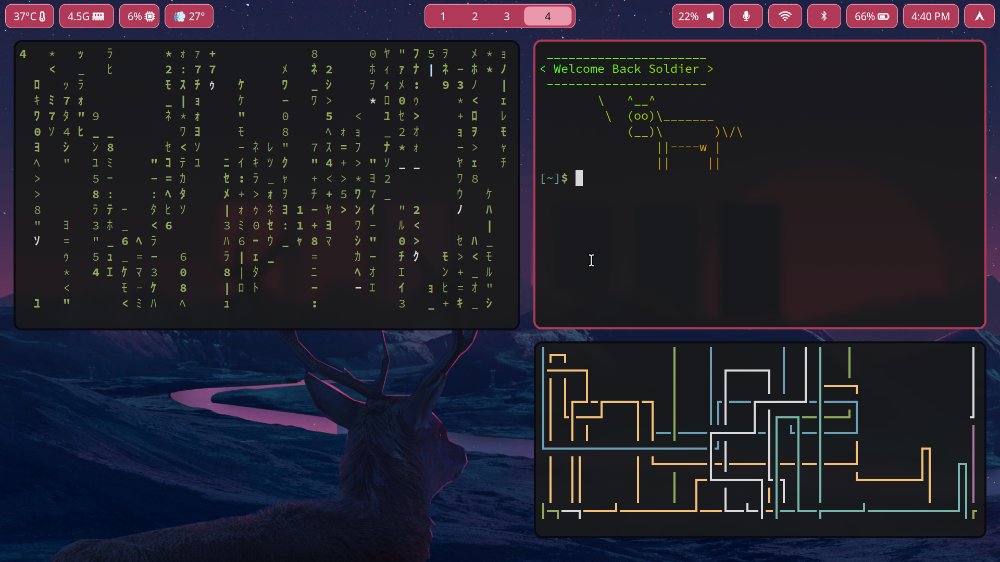
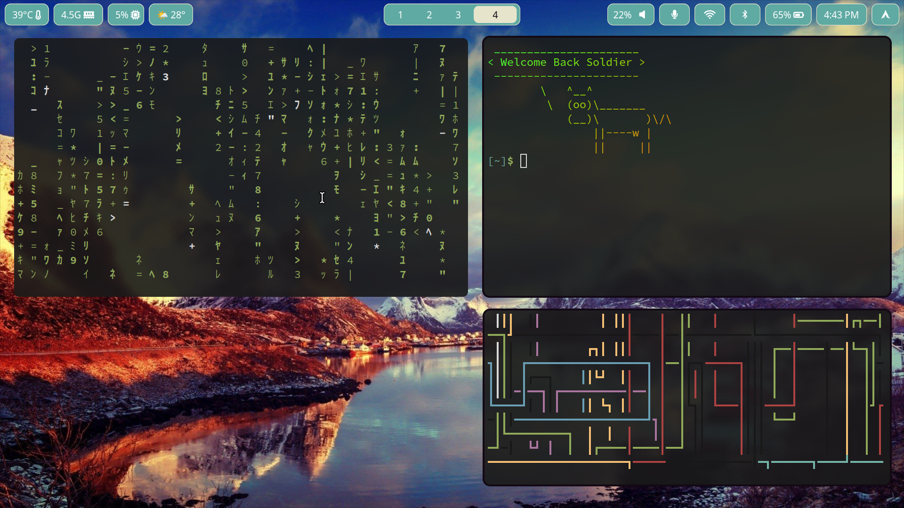

## Screenshot




# TODO

There should be an easier way to set default applications (maybe in the apply-themes script)
i3 sleep should lock the screen and set keyboard lights off after a 30 seconds
eww on xorg, the :visible property doesn't work properly

## Dotfiles inspired from:

https://github.com/JaKooLit/Ja_HyprLanD-dots

https://github.com/linkfrg/dotfiles

https://discord.com/channels/961691461554950145/1230259386535120926

## Secure Boot

If dual booting, make sure to have windows's Bitlock password.
Then go to bios and remove secure boot keys (aka put into setup mode)
Then do the following:

```shell
sudo pacman -S sbctl
sudo sbctl status # Make sure you are in setup mode
sudo sbctl create-keys
sudo sbctl enroll-keys -m
sudo sbctl sign -s -o /usr/lib/systemd/boot/efi/systemd-bootx64.efi.signed /usr/lib/systemd/boot/efi/systemd-bootx64.efi
sudo sbctl sign -s <path-to-kernel> # path to kernel for me was /boot/vmlinuz-linux-lts
sudo sbctl sign -s <path-to-boot-manager> # path to boot manager for me was /boot/efi/EFI/GRUB/grubx64.EFI
sudo sbctl verify # make sure it's all green
```

## Xorg

Article for configuring HiDPI displays on high-end laptops.
https://wiki.archlinux.org/title/HiDPI

Add the following to /etc/X11/xorg.conf.d/30-touchpad.conf for natural scrolling

```
Section "InputClass"
    Identifier "touchpad"
    Driver "libinput"
    MatchIsTouchpad "on"
    Option "Tapping" "on"
    Option "NaturalScrolling" "true"
EndSection
```

## Default apps

```
xdg-settings set default-web-browser brave-browser.desktop
xdg-mime default $file_explorer.desktop inode/directory
xdg-mime default org.gnome.Loupe.desktop image/png
xdg-mime default org.gnome.Loupe.desktop image/jpg
xdg-mime default org.gnome.Loupe.desktop image/jpeg
sudo ln -s /usr/bin/$emulator /usr/bin/xdg-terminal-exec
gsettings set org.gnome.desktop.default-applications.terminal exec $terminal
```

Start samba/smb service (also remember to turn off ufw)\
`sudo ufw disable`\
`sudo systemctl start smb`

## Screen sharing on hyprland

https://gist.github.com/brunoanc/2dea6ddf6974ba4e5d26c3139ffb7580

## latex

https://mathjiajia.github.io/vscode-and-latex/

## General Notes

To force an app to use wayland, add this line to the "exec" option of the app
found in either `/usr/share/applications` or `/usr/share/local/applications`:\
`--enable-features=UseOzonePlatform --ozone-platform=wayland`

If clock is messed up, run the following to enable network based time
`sudo timedatectl set-ntp 1`

Conencting to WiFi automatically with nmcli
`nmcli connection modify SSID connection.autoconnect yes`

Connecting to eduroam:
go to https://cat.eduroam.org/
select the university/college you go to and download the executable python script.
run it, and try to connect now (I had success with nmtui).

Run apps as sudo on hyprland\
`xhost si:localuser:root`\
`xhost | DISPLAY=:0 sudo command`

# fonts and icons

Downloads fonts into either /usr/share/fonts or .local/share/fonts
use sudo fc-cache -fv to install all fonts
use fc-list to list the installed fonts
fc-list : family style
edit .config/fontconfig/fonts.conf to use different fonts:
https://www.baeldung.com/linux/configure-multilingual-fonts

wifi icons:
https://www.figma.com/file/eJgx1YTG2WdQ41B1fZ2wd8/Wifi?type=design&node-id=0%3A1&mode=design&t=Rfg5ME7eZDOHPh7k-1
https://www.iconfinder.com/search?q=wifi&iconset=phosphor-bold-vol-4

volume icons:
https://www.iconfinder.com/search?q=volume&family=ionicons-fill

Good icons:
https://icons8.com/icon/86864/audio

Cursor theme from KDE Store
Bibata-Modern-Ice https://store.kde.org/p/1197198

## GRUB

Download the aesthetic file and use grub-customizer to load it
https://www.gnome-look.org/p/2142488

Add windows 11 to grub
https://askubuntu.com/questions/1425637/how-can-i-add-windows-11-to-grub-menu

## nvim stuff

control + h|l --> go between editor and file manager
control + b --> toggle file manager
control + j --> open terminal
tab --> switch between tabs

## Graphics/nvidia

Make a file `/etc/modprobe.d/nvidia.conf`
and put the following in it:

```
options nvidia_drm modeset=1 fbdev=1
options nvidia NVreg_PreserveVideoMemoryAllocations=1 NVreg_TemporaryFilePath=/var/tmp
```

and `/etc/modprobe.d/blacklist.conf`

```
blacklist nouveau
options nouveau modeset=0
```

Suspense issues:
run the script at `.local/bin/nvidia-suspense`

Switching between integrated and hybrid in nvidia:
https://www.reddit.com/r/rogflow/comments/ri9mf5/making_dgpu_enablingdisabling_on_linux_work_on/

Nvidia drivers on wayland:
https://comfy.guide/client/nvidia/

Apps (chromuim and electron based usually) openening slowly:
https://wiki.archlinux.org/title/Vulkan#AMDGPU_-_Vulkan_applications_launch_slowly

Installing (older) drivers
https://github.com/Frogging-Family/nvidia-all.git

## Games

Plants Vs Zombies
https://www.protondb.com/app/3590#dYYLZr30F2

Games with easy anti-cheat
https://www.reddit.com/r/linux_gaming/comments/1cvrvyg/psa_easy_anticheat_eac_failed_to_initialize/

To run games well on steam, add the following to a game. This setting is located in (gear icon in any game) > properties > general > launch options
This halped a lot with scaling issues with Overwatch 2
`gamescope -W 1920 -H 1080 -r 144 -- %command%`

## udev rules

Go in /etc/udev/rules.d and create two files. (replace USERNAME with your username). This will make sure to give notifications whenever a device is plugged or unplugged in (as well as charging/discharging).

power.rules:

```properties
ACTION=="change", SUBSYSTEM=="power_supply", ATTR{type}=="Mains", ATTR{online}=="0", ENV{DISPLAY}=":0", ENV{XAUTHORITY}="/home/USERNAME/.Xauthority" RUN+="/usr/bin/su USERNAME -c '/home/USERNAME/.local/bin/battery-charging discharging'"
ACTION=="change", SUBSYSTEM=="power_supply", ATTR{type}=="Mains", ATTR{online}=="1", ENV{DISPLAY}=":0", ENV{XAUTHORITY}="/home/USERNAME/.Xauthority" RUN+="/usr/bin/su USERNAME -c '/home/USERNAME/.local/bin/battery-charging charging'"
```

usb.rules:

```properties
ACTION=="add",SUBSYSTEM=="usb",ENV{DISPLAY}=":0", ENV{XAUTHORITY}="/home/USERNAME/.Xauthority" RUN+="/usr/bin/su USERNAME -c '/home/USERNAME/.local/bin/usb-notify 1 %E{DEVNAME}'"
ACTION=="remove",SUBSYSTEM=="usb",ENV{DISPLAY}=":0", ENV{XAUTHORITY}="/home/USERNAME/.Xauthority" RUN+="/usr/bin/su USERNAME -c '/home/USERNAME/.local/bin/usb-notify 0 %E{DEVNAME}'"
```

## Unix Password Manager

download pass
`sudo pacman -S pass pass-otp`

plugins for chromium browsers
`sudo pacman -S browserpass browserpass-chromium`

plugin for firefox browsers
`sudo pacman -S passff-host`
`curl -sSL https://codeberg.org/PassFF/passff-host/releases/download/latest/install_host_app.sh | bash -s -- librewolf`

use pam-gnupg to not enter password everytime
make sure to have the same password for the gpg key and the user you log in as.

```
paru -S pam-gnupg
echo -e "auth     optional  pam_gnupg.so store-only\nsession  optional  pam_gnupg.so" | sudo tee /etc/pam.d/system-login
echo "allow-preset-passphrase" > ~/.gnupg/gpg-agent.conf
```

run `gpg -K --with-keygrip` and copy the keygrip within the block that has [E] in it and paste it into ~/.pam-gnupg.

## Tor Browser (Security)

to connect to a specific country, you must specify it in the "ExitNodes" like this:

```
EntryNodes {ca} StrictNodes 1
ExitNodes {it},{de} StrictNodes 1
```

add this to "torrc" file, in windows it is located in the default tor folder
and in linux it is in /etc/tor/torrc-defaults

1 means it is forced
0 means it can also use other nodes, if they one specified does not work.

in windows go to internet options > connections > LAN settings > Advanced and make sure "Use the same proxy server ..."
is checked off, then delete everything and add this to socks (last option):
socks: localhost port: 9050

## Colours

Nord

```
--nord0: #2e3440;
--nord1: #3b4252;
--nord2: #434c5e;
--nord3: #4c566a;
--nord4: #d8dee9;
--nord5: #e5e9f0;
--nord6: #eceff4;
--nord7: #8fbcbb;
--nord8: #88c0d0;
--nord9: #81a1c1;
--nord10: #5e81ac;
--nord11: #bf616a;
--nord12: #d08770;
--nord13: #ebcb8b;
--nord14: #a3be8c;
--nord15: #b48ead;
```

Nord modified by me

```
$nord0: #2e3440;
$nord1: #3b4252;
$nord2: #434c5e;
$nord3: #4c566a;
$nord4: #d8dee9;
$nord5: #e5e9f0;
$nord6: #eceff4;
$nord7: #8fbcbb;
$nord8: #88c0d0;
$nord9: #81a1c1;
$nord10: #5e81ac;
$nord11: #bf616a;
$nord12: #d08770;
$nord13: #ebcb8b;
$nord14: #a3be8c;
$nord15: #b48ead;
```

One dark

```
[colors]
# special
foreground      = #abb2bf
foreground_bold = #abb2bf
# cursor          = #111111
background      = rgba(16, 16, 16, 0.9)
# black
color0  = #282c34
color8  = #5c6370
# red
color1  = #e06c75
color9  = #be5046
# green
color2  = #98c379
color10 = #7a9f60
# yellow
color3  = #e5c07b
color11 = #d19a66
# blue
color4  = #61afef
color12 = #3b84c0
# magenta
color5  = #c678dd
color13 = #9a52af
# cyan
color6  = #56b6c2
color14 = #3c909b
# white
color7  = #abb2bf
color15 = #828997
```
